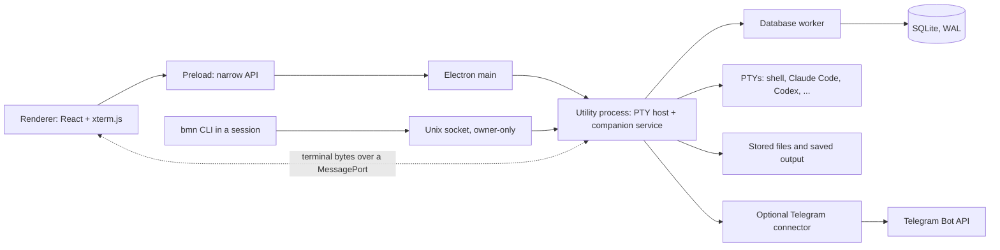

# Architecture

BMN is an Electron application with four kinds of process. One of them, the utility
process, owns all durable state and every running terminal. The window only presents it.



## Processes

| Process | Owns | Code |
| --- | --- | --- |
| Main | Windows, OS dialogs, application lifecycle (quit, close, single instance), voice engine calls | `apps/desktop/src/main` |
| Renderer | The interface: sidebar, panes, one live xterm.js per session, preferences | `apps/desktop/src/renderer` |
| Preload | The only bridge from the renderer to the main process, as a typed, validated API | `apps/desktop/src/preload` |
| Utility | node-pty terminals, the control socket, stored files, backups, Telegram | `apps/desktop/src/utility` |
| Database worker | The single SQLite connection; every write is one transaction | `apps/desktop/src/utility/database-worker.ts` |

Messages between processes are defined once in `shared/protocol` (`@bmn/protocol`) and
validated on arrival.

## Rules the code follows

**One owner of state.** The utility process alone creates workspace, session, file and request IDs
and writes records. Every addressed action names its session and, for a live process, its
*incarnation* (one run of the session's command). The currently focused pane never fills in a
missing target.

**One owner per claim.** When a flow reserves something for the duration of asynchronous work, it
holds one invariant: establish the reservation before the first `await`, revalidate it after every
asynchronous gap, and release only the reservation you still own. Establishing is a synchronous
check-and-set or one transactional state change; revalidation compares identity after the gap (the
same reservation object, incarnation or update time); a stale finisher that no longer owns the
claim changes nothing. The claim-shaped flows and their state:

| Claim | Establish | Revalidate | Release | State |
| --- | --- | --- | --- | --- |
| Handoff draft paste | draft → *uncertain* in one database transaction, keyed by the draft's update time (`claimHandoffDraft`, `database-companion-store.ts`) | claim conflicts on a changed update time; destination re-read and incarnation re-checked after the claim (`sendDraftLocked`, `companion-service.ts`) | `finishHandoffDraft` accepts only the *uncertain* claim it holds: definite pre-write failures finish back to *draft*, and a PTY write of unknown outcome deliberately stays *uncertain* | UNVERIFIED: one gap |
| Conversation identity | synchronous check-and-set (`claimConversation`, `session-manager.ts`) | swap re-checks the held identity around the in-flight store write | identity-checked rollback and teardown (`swapConversationClaim`, `removeIfCurrent`) | UNVERIFIED: one gap |
| Cohort resume action | one recorded promise per idempotency key, set before any `await` (`resumeCohort`, `session-manager.ts`) | repeats return the recorded outcome | entries are kept for the process lifetime: the record *is* the idempotency | Protected |
| Repeat-watch state | per-session notice queue; state read and written inside the queued operation (`observeHookEvent`, `companion-service.ts`) | the open notice row and the live incarnation are re-read before opening or withdrawing | queue tail removes itself when still current | UNVERIFIED: three gaps |
| Voice model download slot | claimed before the first `await`, before folder and install checks (`aiterm:voice:download`, `voice-ipc.ts`) | abort and slot identity re-checked after the checks | released only by its owner on every exit; a failure stays visible until Dismiss | Migrated (fenced) |

A flow that already holds the invariant is not rewritten; a migration happens only behind a fence
test that first fails on the demonstrated interleaving. An async gap that no test covers is recorded
as unverified in the [tracked claim audit](claim-audit.md), never as protected.

**Your CLIs stay in charge.** Sessions run the installed executables in real PTYs with your saved
arguments and working directory. The app adds no bypass flags and never copies CLI credentials.
Terminal variables that identify another terminal (tmux, other emulators) are removed; sessions get
`TERM=xterm-256color` and `COLORTERM=truecolor`.

**What a new session inherits.** BMN passes its own environment to each new shell after removing
Electron and Chromium internals, BMN's own variables (which it re-issues for that session), the
launching terminal's identity and the launching agent's session identity. The exact exclusions are
`SHELL_ENVIRONMENT_PRIVATE_KEYS` in `session-manager.ts`; owner configuration such as
`CLAUDE_CODE_FORCE_SESSION_PERSISTENCE` passes through.

**One live view per session.** Output goes from the PTY to one xterm.js instance over a dedicated,
bounded MessagePort. There is no tmux, no headless mirror and no replay of old bytes into a live
terminal, because a second emulator tracking the same state drifts. *Saved output* is a separate,
read-only plain-text snapshot of the live screen, written periodically, on stop and on quit. After a
renderer crash, a new view is created and the program is asked to repaint; the process keeps
running.

**Windows and processes have separate lifetimes.** Closing the window applies each session's
saved keep-running or stop choice; it asks about running sessions set to Ask. Keeping a session
running minimizes the window. Quit lists the running sessions and asks first. A Stop whose outcome
is unknown keeps the process listed as *exit unconfirmed* until the host reports the exit.
Launching the app again brings the existing window forward. After a crash or reboot, earlier
processes are marked interrupted and nothing restarts on its own; Resume reopens a known Claude
Code, Codex or OpenCode conversation through its CLI.

**A narrow local control boundary.** Agents use JSON-RPC over a Unix socket in an owner-only
runtime folder. There is no TCP listener. Each session receives a token that only works for that
session; the owner token lives next to the socket. Requests are checked for schema, size, caller,
target and incarnation. See [agent-control.md](agent-control.md).

**Input submission is not delivery.** Addressed input gets an idempotency receipt before it runs.
Writing to a PTY proves submission only, and an interrupted delivery is marked uncertain rather than
resent.

**Files are immutable originals.** A published or attached file is copied into staging, hashed,
validated and moved into place atomically before its record is committed. Previews are requested
by file ID, never by path. Save As checks the stored file against its hash before copying it to the
chosen destination.

**A file reference is a live read, not a stored file.** Opening a path an agent printed (Ctrl+click, or
Open file reference… in the palette) sends the owner's session, the reference text and an optional
chosen folder through preload and main to the utility. The utility parses the reference again,
resolves a relative path against the session's launch directory (never a guessed shell directory),
follows symlinks, opens the result without following a final symlink or blocking, and reads it only
when it is a regular UTF-8 text file of at most 1 MiB. The launch directory is the one the running
process started in; once the process has exited it is the session's stored folder, which may since
have been edited. Either way the dialog shows the exact folder used. After reading, the canonical
path must still name the file that was read, or the preview reports that the file changed. The
preview is a snapshot that refreshes only on request; it is never copied into the stored files and
adds nothing to the agent control socket. Show in folder reveals only a file that window was shown.
Terminal links are found only in the line xterm.js asks about, without touching the filesystem, are
checked against the printed text again when clicked, and are off while a program reads the mouse.

**Progress and requests keep their evidence.** Process state, progress reports, unread state and
the resolution of an agent's question are stored separately. An agent saying it is done is shown as
a claim, not as verified success. A question stays open until it is answered or withdrawn.
The optional workspace results view reads the latest report per session and named source,
its evidence references and the bounded draft list. It rechecks the exact report or handoff
before routing the owner to the existing detail or Files flow; the view cannot deliver a draft.

**Hook configuration and observation are separate facts.** A bounded utility read runs BMN's
existing hook checker, redacts configuration contents and gives Preferences a dated report.
The utility also retains the latest attributable harness event per session and process
incarnation in memory, independently of the 30-event diagnostic log. Session details reads
that summary for its addressed run; a missing event is not a health verdict.

**One transactional path for metadata.** SQLite in WAL mode with foreign keys and ordered
migrations, through one worker. Backups hold a consistent database snapshot, the referenced files
and a hash manifest; verification checks the files against the manifest and against the backup's
own database.

**Saved sets are definitions.** One workspace-owned SQLite row stores each named set's copied,
ordered command entries. Starting one takes a process-lifetime idempotency key in the utility,
validates every entry before the first start, and calls the normal session creation path in
order. Each created session remains an ordinary record; a failed entry can also leave an exited
record when its process ends during startup. No attempt table or automatic replay exists. The
renderer can only request this owner action through its authorized preload route; the session
control socket has no launch-set method.

**Git identity is an observation.** The utility makes bounded, shell-free Git reads for one
selected directory. It reports repository root, branch state and linked worktree status with an
observation time, or an explicit non-repository/unavailable result. The renderer discards stale
answers after the selected session, directory or set revision changes and rechecks before an
explicit start. No Git write or worktree management is part of the route.

**Telegram is an optional client.** It polls the Bot API outbound, answers only the allowed chat
and user, and maps each notification to its session and request. A reply to a stale session or a
resolved request becomes a draft instead of reaching the wrong process. Only one program may poll a
bot token at a time; the connector takes a lock for it. See [telegram.md](telegram.md).

**Bounded storage, private files.** XDG folders with owner-only modes; limits on message sizes,
queues, scrollback and preview decoding. Stored originals are only removed by an explicit delete.

## What survives

Sessions and windows end in seven ways. This table says what each one keeps, so neither you nor an
agent has to guess.

| Ending | Process | Live screen | Saved output | Session record and layout | Conversation resume | Open Needs you requests |
| --- | --- | --- | --- | --- | --- | --- |
| Close the window, keep the sessions | Keeps running | Kept: the window is minimized, not destroyed | Captured on the same cadence | Unchanged | Not needed; nothing stopped | Stay open |
| Close the window and stop the sessions | Stopped, recorded *interrupted · last window close* | Ends with the process | A final capture is taken before the stop | Unchanged; the pane keeps its place | Resume reopens a bound conversation | Stay open; a harness that sends `SessionEnd` withdraws the ones its hook opened |
| Quit | Stopped after BMN lists the running sessions and asks, recorded *interrupted · application quit* | Ends with the process | A final capture is taken before the stop | Unchanged | Resume reopens a bound conversation; the next start offers to resume them all in one dialog | Stay open; `SessionEnd` withdraws the hook's own |
| Stop a session | Stopped; an unconfirmed stop stays *exit unconfirmed* until the host reports the exit | Ends with the process | A final capture is taken before the stop | Unchanged | Resume reopens a bound conversation | Stay open; `SessionEnd` withdraws the hook's own |
| Renderer crash | Keeps running | A new view is created, brought to the private terminal mode state the program is in, and the program is asked to repaint once; bytes from before the crash are not replayed | Unaffected | Unchanged: order, selection, scroll position and follow-tail are restored | Not needed; nothing stopped | Stay open |
| App crash or reboot | Ends when its pseudo-terminal closes (UNVERIFIED); the next start marks earlier incarnations *interrupted* and starts nothing by itself | Gone | The last periodic capture; output written after it is lost | Unchanged | Resume reopens a bound conversation, including one a `SessionStart` hook reported | Stay open |
| Desktop update | Stopped: packaging waits for BMN to exit, and an update installed while it runs stops the sessions, recorded *interrupted · update restart* | Ends with the process | A final capture is taken before the stop | Unchanged | Resume reopens a bound Claude/Codex conversation or OpenCode with `--session`; the next start offers to resume them all in one dialog | Stay open |

Saved output is a plain-text snapshot of the live screen, taken periodically, on stop and on quit;
it is never replayed into a terminal. *Resume* reopens the stored Claude Code or Codex conversation
through each CLI's own resume, or an OpenCode conversation with `opencode --session <id>`, and only
for a session whose conversation BMN knows: one it pinned at launch, one you located by hand, or one
the harness reported through its `SessionStart` hook or OpenCode plugin. A
session without that stays honest about it and offers **Start again** instead.

A rebuilt view is brought to the mode state the program was already in. The host reads the private
modes out of the bytes it already streams — paste bracketing, focus reports, the mouse protocol and
its encoding, the alternate screen — and hands the new view the ones a fresh terminal would get
wrong, in both directions: what the program turned on, and the autowrap and cursor it turned off.
The view sets them in itself. The program is never written to and never asked to repeat the modes,
so it neither redraws twice nor learns the view was replaced.

Resume shows the exact command first. The confirmation is built from the same launch the process is
started with, so what you read is what runs, and it names any stored argument the CLI's own resume
will not take — by kind, never quoting a prompt you typed.

After an update or a quit, the next start offers the sessions that stop interrupted in one dialog:
one row each with the exact Resume command, or **Start again** with the stored command for a session
without a bound conversation. Resume rows are checked, Start again rows are not, and the rows start
in order, one at a time, stopping after the first failure — every row ends up reading *started*,
*failed* with the reason, or *not started*. Nothing begins until the button, and the offer is made
once per stop; **Resume interrupted sessions…** in the palette reopens it.

The Electron self-test checks the renderer-crash row (processes, layout and terminal modes survive
a new view), the Quit row's interruption record and reason after restart, and parts of the close
and explicit-stop rows against the running app. A mixed close confirms that the kept session stays
live without a lifecycle capture while the stopped session receives a final capture. The pure
all-kept close and the visible minimized-window state remain unexercised by that self-test. App
crash, reboot and desktop update still lack compliant end-to-end trials; see the
[survival matrix](survival-matrix.md) for the exact PASS, FAIL and UNVERIFIED cells.

## Electron hardening

- Context isolation, renderer sandbox, no Node.js integration.
- Every IPC handler checks that the sender is one of the app's own windows.
- A restrictive Content Security Policy (`default-src 'self'`).
- The Chromium sandbox is never disabled. `scripts/lib/sandbox-flag-audit.mjs` fails the tests if a
  sandbox-disabling flag appears anywhere in the source.

## Repository layout

```text
apps/desktop/
  bin/bmn                command-line client for the control socket
  src/main/              Electron main process
  src/preload/           the renderer's API
  src/renderer/          React interface
  src/utility/           PTY host, companion service, database, Telegram
  resources/             icons and the packaged CLI launcher; the built voice engine lands in resources/whisper (gitignored)
shared/protocol/         message types and validation shared by every process
scripts/
  build/                 native module rebuild for Electron
  install/               Linux launcher and icons
  lib/                   shared pieces of the packaging and launcher scripts
  sandbox/               AppArmor profile template for Ubuntu 24.04+
  smoke/                 packaged build smoke test
  test/                  Electron self-test and the throwaway-root dev launcher
  tests/                 unit tests for the scripts above
  voice/                 pinned whisper.cpp build
```
