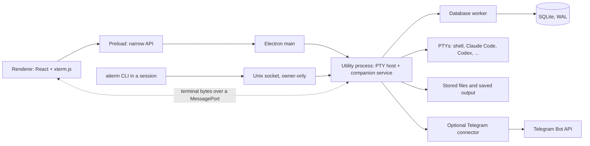

# Architecture

BMN is an Electron application with four kinds of process. One of them, the utility
process, owns all durable state and every running terminal. The window only presents it.



## Processes

| Process | Owns | Code |
| --- | --- | --- |
| Main | Windows, OS dialogs, application lifecycle (quit, close, single instance), voice engine calls | `apps/desktop/src/main` |
| Renderer | The interface: sidebar, panes, one live xterm.js per session, preferences | `apps/desktop/src/renderer` |
| Preload | The only bridge from the renderer to the main process, as a typed, validated API | `apps/desktop/src/preload` |
| Utility | node-pty terminals, the control socket, stored files, backups, Telegram | `apps/desktop/src/utility` |
| Database worker | The single SQLite connection; every write is one transaction | `apps/desktop/src/utility/database-worker.ts` |

Messages between processes are defined once in `shared/protocol` (`@ai-terminal/protocol`) and
validated on arrival.

## Rules the code follows

**One owner of state.** The utility process alone creates workspace, session, file and request IDs
and writes records. Every addressed action names its session and, for a live process, its
*incarnation* (one run of the session's command). The currently focused pane never fills in a
missing target.

**Your CLIs stay in charge.** Sessions run the installed executables in real PTYs with your saved
arguments and working directory. The app adds no bypass flags and never copies CLI credentials.
Terminal variables that identify another terminal (tmux, other emulators) are removed; sessions get
`TERM=xterm-256color` and `COLORTERM=truecolor`.

**One live view per session.** Output goes from the PTY to one xterm.js instance over a dedicated,
bounded MessagePort. There is no tmux, no headless mirror and no replay of old bytes into a live
terminal, because a second emulator tracking the same state drifts. *Saved output* is a separate,
read-only plain-text snapshot of the live screen, written periodically, on stop and on quit. After a
renderer crash, a new view is created and the program is asked to repaint; the process keeps
running.

**Windows and processes have separate lifetimes.** Closing the window never silently kills a
process. With sessions running, Close asks whether to keep them running (the window minimizes) or
stop them; Quit lists the running sessions and asks first. A Stop whose outcome is unknown keeps
the process listed as *exit unconfirmed* until the host reports the exit. Launching the app again
brings the existing window forward. After a crash or reboot, earlier processes are marked
interrupted and nothing restarts on its own; Resume reopens a Claude Code or Codex conversation
through the CLI's own resume.

**A narrow local control boundary.** Agents use JSON-RPC over a Unix socket in an owner-only
runtime folder. There is no TCP listener. Each session receives a token that only works for that
session; the owner token lives next to the socket. Requests are checked for schema, size, caller,
target and incarnation. See [agent-control.md](agent-control.md).

**Input submission is not delivery.** Addressed input gets an idempotency receipt before it runs.
Writing to a PTY proves submission only, and an interrupted delivery is marked uncertain rather than
resent.

**Files are immutable originals.** A published or attached file is copied into staging, hashed,
validated and moved into place atomically before its record is committed. Previews are requested
by file ID, never by path. Save As checks the stored file against its hash before copying it to the
chosen destination.

**Progress and requests keep their evidence.** Process state, progress reports, unread state and
the resolution of an agent's question are stored separately. An agent saying it is done is shown as
a claim, not as verified success. A question stays open until it is answered or withdrawn.

**One transactional path for metadata.** SQLite in WAL mode with foreign keys and ordered
migrations, through one worker. Backups hold a consistent database snapshot, the referenced files
and a hash manifest; verification checks the files against the manifest and against the backup's
own database.

**Telegram is an optional client.** It polls the Bot API outbound, answers only the allowed chat
and user, and maps each notification to its session and request. A reply to a stale session or a
resolved request becomes a draft instead of reaching the wrong process. Only one program may poll a
bot token at a time; the connector takes a lock for it. See [telegram.md](telegram.md).

**Bounded storage, private files.** XDG folders with owner-only modes; limits on message sizes,
queues, scrollback and preview decoding. Stored originals are only removed by an explicit delete.

## Electron hardening

- Context isolation, renderer sandbox, no Node.js integration.
- Every IPC handler checks that the sender is one of the app's own windows.
- A restrictive Content Security Policy (`default-src 'self'`).
- The Chromium sandbox is never disabled. `scripts/lib/sandbox-flag-audit.mjs` fails the tests if a
  sandbox-disabling flag appears anywhere in the source.

## Repository layout

```text
apps/desktop/
  bin/aiterm             command-line client for the control socket
  src/main/              Electron main process
  src/preload/           the renderer's API
  src/renderer/          React interface
  src/utility/           PTY host, companion service, database, Telegram
  resources/             icons; the built voice engine lands in resources/whisper (gitignored)
shared/protocol/         message types and validation shared by every process
scripts/
  build/                 native module rebuild for Electron
  install/               desktop launcher and icons
  sandbox/               AppArmor profile template for Ubuntu 24.04+
  smoke/                 packaged build smoke test
  test/                  Electron self-test and the throwaway-root dev launcher
  voice/                 pinned whisper.cpp build
```
